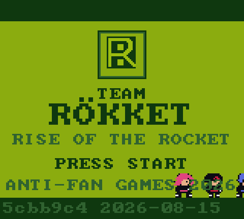
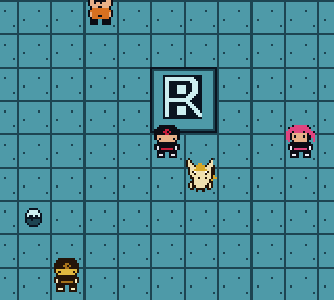

# TEAM ROKKET

A Game Boy-style heist RPG that runs in the browser, where you play the
grunts rather than the hero. It is a parody game born from a childhood
dream of an anti-hero, Team-Rocket-side Pokémon game. It started life as
a single HTML file with a canvas in it, and I'm growing it into a modular
TypeScript project one card deck at a time.

**Play it:** <https://rokket-boy.uk> - a push to `main` is a
production deploy, so merges are deliberate.

<p align="center">
  
  
</p>

The whole game ships as one HTML file (currently about 142 KB, 44 KB
gzipped) with the pixel art, maps and music all encoded as strings inside
it. There is no backend and no build-time asset pipeline to speak of: the
sprites are pixel strings, the tunes are token strings for a four-channel
sequencer, and the maps are text.

## Running it locally

```sh
npm install
npm run dev
```

The gate, which CI runs on every pull request and which I keep green
before merging:

| Command | What it does |
|---|---|
| `npm run typecheck` | `tsc --noEmit`, strict |
| `npm run lint` | ESLint over everything, including a no-stray-`console` rule on `src/` |
| `npm test` | Vitest unit suite, including the data and content lints |
| `npm run build` | Typecheck + Vite single-file build → `dist/team-rokket.html` |

`npm run test:e2e` runs the Playwright specs in a real browser; CI runs
them on every push to `main` as a post-deploy check (the deploy itself
doesn't wait for them). `npm run test:e2e:prod` drives the live URL and
is opt-in by design, so the normal gate never touches the network.

## What's in the repo

| Where | What |
|---|---|
| `src/engine/` | Renderer, input, audio, sprite frames, game loop, seeded RNG |
| `src/systems/` | Script interpreter, world, dialog, menu, battle, quest, save |
| `src/data/` | Tiles, characters, music, maps, dialog scripts, encounters, species, items |
| `src/state.ts` | The typed `GameState` |
| `tests/` · `e2e/` | Vitest units and lints; Playwright specs |
| `ROADMAP.md` | What's shipped and what's planned, at feature level |

Content is data. Interactions are `ScriptStep[]` entries in
`src/data/dialog/`, run by `src/systems/script.ts` through a small hooks
interface, so adding a chapter mostly means writing data rather than code.
The systems modules that roll dice take an injected RNG, which is what lets
the battle and encounter tests be seeded and reproducible. See
[CONTRIBUTING.md](CONTRIBUTING.md) for the house rules; the module tree is
small enough that `src/` itself is the map.

## Privacy

No accounts, no analytics, no cookies, no backend. Your save lives in your
browser's localStorage (or in memory for the session, if your browser
blocks storage) and never leaves your device. The game code makes no
network calls, and the served page's Content-Security-Policy is
`default-src 'none'` with a hash-pinned script, so the browser would block
any script, image, font or `fetch`/WebSocket connection to any origin
even if one were added by mistake.

## Contributing

Issues and pull requests are welcome, with the caveat that this is a hobby
project I work on in short sessions, so replies may take a while. Start
with [ROADMAP.md](ROADMAP.md) for what's shipped and what's next, then
read [CONTRIBUTING.md](CONTRIBUTING.md) for how the code is organised,
what the gate expects and how a pull request actually lands. Nobody
merges to `main` here but me: every change arrives as a pull request,
I review and playtest it, and I merge it. Sessions here are agent-driven
(Claude Code, with OpenCode as a parallel harness); the harness files, my
planning notes and my working journals live in a private working repo,
and this repository is a mirror of the parts that matter to a reader: the
game, its tests, the front door. Nothing you need in order to build or
contribute is missing from it.

## A note on the parody

This is a hobby passion project and a potential portfolio piece, made out
of affection for a game I played as a kid and a long-held wish to play it
from the other side. It is not affiliated with, endorsed by, or connected
to Nintendo, Game Freak or The Pokémon Company. No assets are copied:
every sprite, map and track is original data in this repository, and the
names are their own thing.

## Licence

MIT, see [LICENSE](LICENSE).
